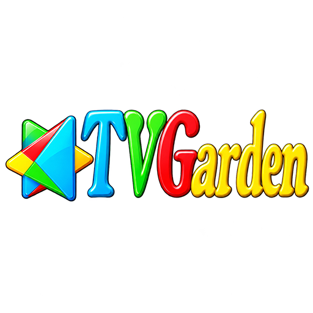
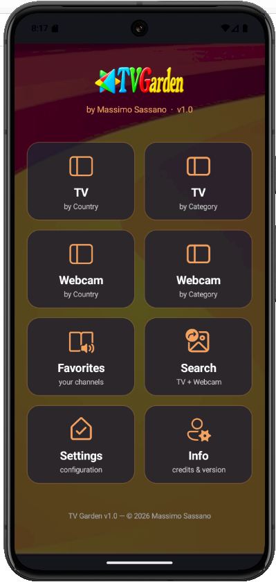
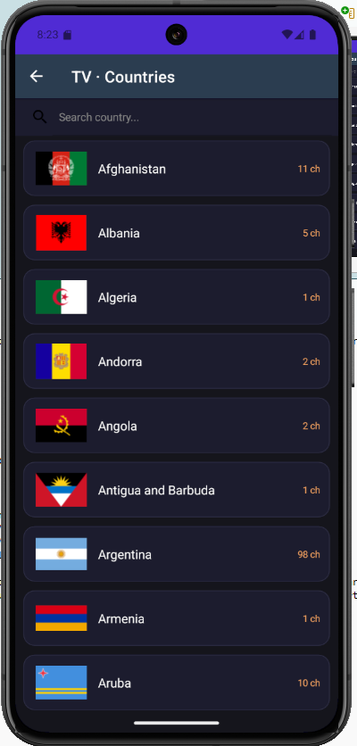
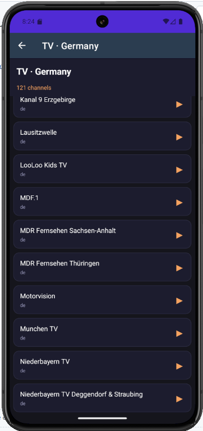
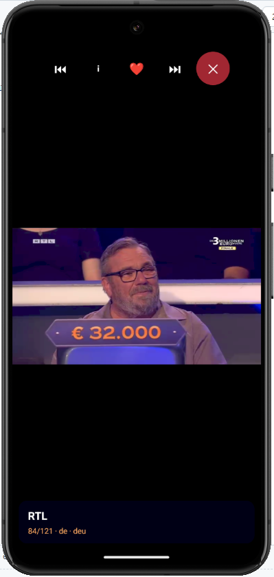
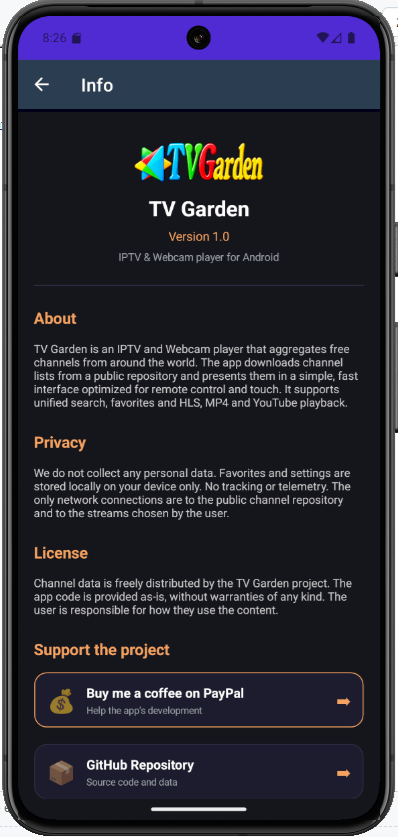

# 🌍 TV Garden

**IPTV & Webcam player per Android** · **IPTV & Webcam player for Android**

*Guarda migliaia di canali TV e webcam live da tutto il mondo — gratis.*

*Watch thousands of TV channels and live webcams from around the world — free.*

  

---

> 🇮🇹 **[Italiano](#-italiano)** &nbsp;·&nbsp; 🇬🇧 **[English](#-english)**

---

## 🇮🇹 Italiano

### 📖 Cos'è TV Garden

TV Garden è un'app Android gratuita che ti permette di guardare:

- 📺 **Canali TV** da oltre **150 paesi**
- 📹 **Webcam live** (spiagge, città, montagne, animali)
- 🎬 **Canali YouTube** integrati
- ⭐ I tuoi **canali preferiti**

Tutti i contenuti sono **pubblici e gratuiti**. L'app non ospita nessuno stream: raccoglie link da fonti aperte e li organizza per paese e categoria.

### 📥 Download

👉 **Scarica l'ultima versione:** [**TVGarden.apk**](https://github.com/maxsassano/tvgarden/releases/latest)

#### Installazione

1. Scarica il file `.apk` sul telefono
2. Vai in **Impostazioni → Sicurezza → Consenti installazione da sorgenti sconosciute**
3. Apri il file scaricato e installa
4. Avvia TV Garden 🎉

**Requisiti:** Android 5.0 o superiore

### 📱 Screenshot

  

  
  

  
  

> *Screenshot in arrivo — verranno aggiunti prossimamente.*

### ❓ Come si usa

#### 🏠 Home

All'apertura trovi 8 pulsanti:

| Pulsante | Cosa fa |
|----------|---------|
| **TV · per Paese** | Scegli un paese e vedi i canali TV |
| **TV · per Categoria** | Scegli una categoria (news, sport, cinema…) |
| **Webcam · per Paese** | Webcam live organizzate per paese |
| **Webcam · per Categoria** | Webcam per tipo (spiagge, città, animali…) |
| **Preferiti** | I canali che hai salvato |
| **Cerca** | Cerca un canale per nome |
| **Impostazioni** | Lingua e cache |
| **Info** | Crediti e versione |

#### 📺 Guardare un canale

1. Tocca **TV · per Paese** (o una qualsiasi altra card)
2. Seleziona un paese (es. 🇮🇹 Italia)
3. Tocca un canale per riprodurlo

#### ▶ Comandi del Player

| Pulsante | Azione |
|----------|--------|
| **⏮** | Canale precedente |
| **⏭** | Canale successivo |
| **ℹ** | Mostra/nascondi info |
| **❤** | Aggiungi ai preferiti |
| **✕** | Chiudi player |

#### 🔍 Cercare un canale

1. Tocca **Cerca** nella Home
2. Digita il nome del canale
3. Tocca il risultato per riprodurlo

#### 🌍 Cambiare lingua

1. **Home → Impostazioni**
2. Scegli **English** o **Italiano**
3. La lingua cambia immediatamente in tutta l'app

#### ⭐ Preferiti

- **Aggiungi:** nel player tocca **❤**
- **Vedi:** dalla Home tocca **Preferiti**
- **Rimuovi:** swipe verso sinistra sul canale
- **Svuota tutto:** pulsante rosso in fondo

### ⚠️ Note

- Alcuni canali potrebbero **non funzionare** perché gli stream pubblici cambiano spesso
- Serve una **connessione internet** stabile (Wi-Fi o 4G/5G)
- L'app è **gratuita** e **senza pubblicità**

### 💛 Supporto

Se TV Garden ti piace e vuoi sostenere lo sviluppo:

[**☕ Offrimi un caffè su PayPal**](https://paypal.me/veruscatanese/3EUR)

---

## 🇬🇧 English

### 📖 What is TV Garden

TV Garden is a free Android app that lets you watch:

- 📺 **TV channels** from over **150 countries**
- 📹 **Live webcams** (beaches, cities, mountains, animals)
- 🎬 **YouTube channels** integrated
- ⭐ Your **favorite channels**

All content is **public and free**. The app doesn't host any stream: it gathers links from open sources and organizes them by country and category.

### 📥 Download

👉 **Download the latest version:** [**TVGarden.apk**](https://github.com/maxsassano/tvgarden/releases/latest)

#### Installation

1. Download the `.apk` file to your phone
2. Go to **Settings → Security → Allow installation from unknown sources**
3. Open the downloaded file and install
4. Launch TV Garden 🎉

**Requirements:** Android 5.0 or higher

### ❓ How to use

#### 🏠 Home

When you open the app, you'll find 8 buttons:

| Button | What it does |
|--------|--------------|
| **TV · by Country** | Choose a country and see TV channels |
| **TV · by Category** | Choose a category (news, sports, movies…) |
| **Webcam · by Country** | Live webcams organized by country |
| **Webcam · by Category** | Webcams by type (beaches, cities, animals…) |
| **Favorites** | The channels you saved |
| **Search** | Search a channel by name |
| **Settings** | Language and cache |
| **Info** | Credits and version |

#### 📺 Watching a channel

1. Tap **TV · by Country** (or any other card)
2. Select a country (e.g. 🇬🇧 United Kingdom)
3. Tap a channel to play it

#### ▶ Player controls

| Button | Action |
|--------|--------|
| **⏮** | Previous channel |
| **⏭** | Next channel |
| **ℹ** | Show/hide info |
| **❤** | Add to favorites |
| **✕** | Close player |

#### 🔍 Searching for a channel

1. Tap **Search** on the Home
2. Type the channel name
3. Tap the result to play it

#### 🌍 Changing language

1. **Home → Settings**
2. Choose **English** or **Italiano**
3. The language changes immediately across the app

#### ⭐ Favorites

- **Add:** in the player tap **❤**
- **View:** from the Home tap **Favorites**
- **Remove:** swipe left on the channel
- **Clear all:** red button at the bottom

### ⚠️ Notes

- Some channels may **not work** because public streams change often
- A stable **internet connection** is required (Wi-Fi or 4G/5G)
- The app is **free** and **ad-free**

### 💛 Support

If you like TV Garden and want to support development:

[**☕ Buy me a coffee on PayPal**](https://paypal.me/veruscatanese/3EUR)

---

## 📄 License · Licenza

see the [LICENSE](LICENSE) file for details.
vedi il file [LICENSE](LICENSE) per i dettagli.

Channel data belongs to its respective owners and is distributed from public sources.
I dati dei canali appartengono ai rispettivi proprietari e sono distribuiti da fonti pubbliche.

---

**Made with ❤️ in Italy**

